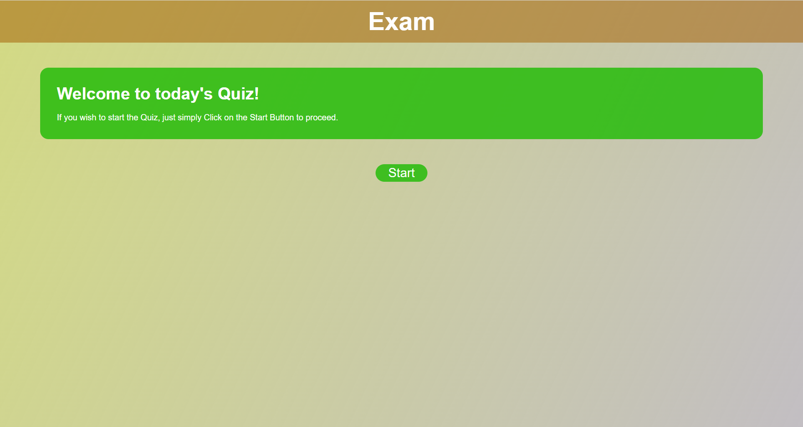
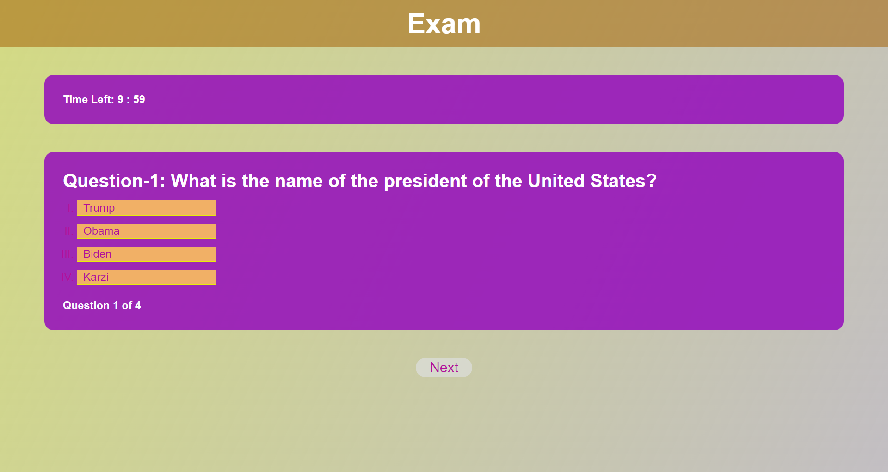
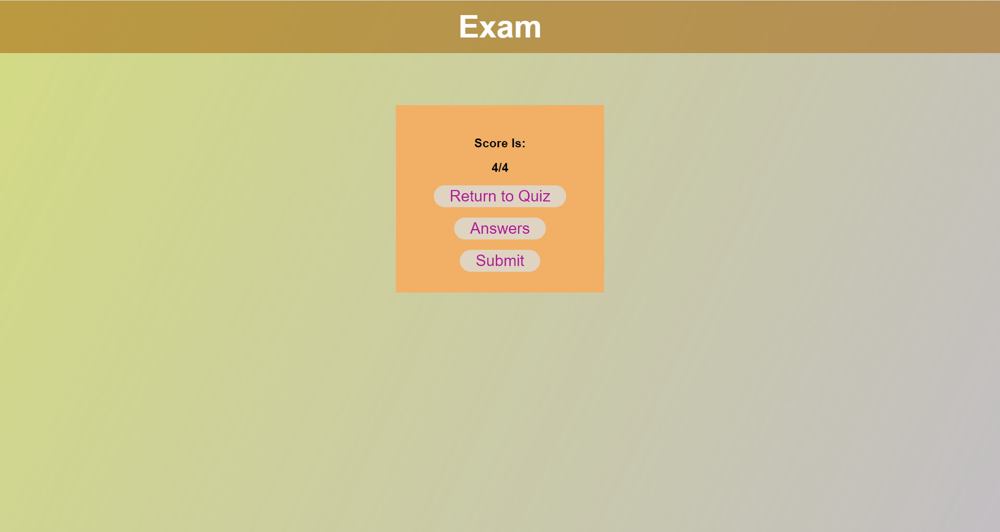
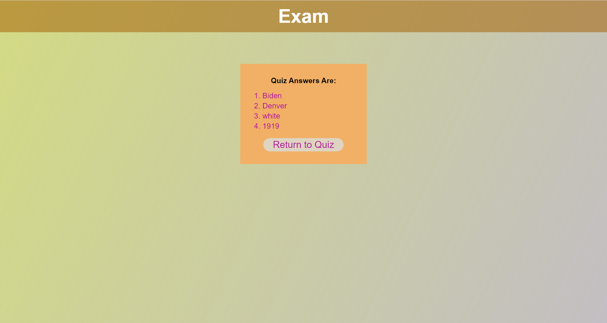

# Modue-4-Web-API-Assignement

## Description
### Web API portal, allows the test takers to start the quiz, answer questions, view results, scores and retake the quiz.

### When the page first loads, the user will be represented with the start page!
Link: [https://sadat6.github.io/Modue-4-Web-API-Assignement/](https://sadat6.github.io/Modue-4-Web-API-Assignement/)

When a user clicks on a start button, he will be represented with an exam page as below. This page has a Timer which allows a user to take the quiz with a given time.

When all the questions are answered, the user will be represented with the result of his/ her quiz as below. If a user wish to see the answers, he/ she needs to click on the button Answers.

User will be represented with the quiz answers as below. If the user wish to go back to the quick and retake it, he/ she can simply click on the Return to Quiz button, and will be redirected back to the main exam board.

## Installation
None